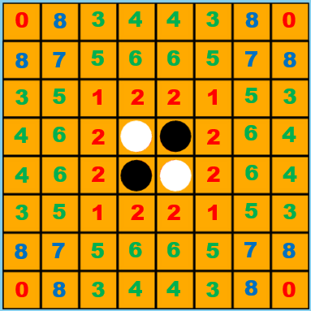

# 人工智能


我做了三个难度


# 初级


初级难度就是随便下，上一篇，有一个函数 [getLegal](./engine.md) 用来获取所有可以落子的坐标


初级难度，cpu就是自己随机选择一个


```js
const arr = engine.getLegal();
const [ col, row ] = arr[parseInt(Math.random() * arr.length)];
const data = { col, row, color: _this.getColor() };
const e = { type: AIPlayer.EVENT.MOVE, data };
_this.dispatchEvent(e);
```


# 中级


中级我们按照有限度做了策略


> Roxanne 策略 详见 《Analysis of Monte Carlo Techniques in Othello》 
> 提出者：Canosa, R. Roxanne canosa homepage. https://www.cs.rit.edu/~rlc/ 


我们把8*8的所有位置分了一下优先级


我们画个图清楚的表现一下





那么根据Roxanne策略写一个类，就是让cpu按照优先级落子，这就是中级难度


```js
class Roxanne {
  constructor() {
    this._table = [ // 优先级
      [ [0, 0], [0, 7], [7, 0], [7, 7] ],
      [ [2, 2], [2, 5], [5, 2], [5, 5] ],
      [ [3, 2], [3, 5], [4, 2], [4, 5], [2, 3], [2, 4], [5, 3], [5, 4] ],
      [ [2, 0], [2, 7], [5, 0], [5, 7], [0, 2], [0, 5], [7, 2], [7, 5] ],
      [ [3, 0], [3, 7], [4, 0], [4, 7], [0, 3], [0, 4], [7, 3], [7, 4] ],
      [ [2, 1], [2, 6], [5, 1], [5, 6], [1, 2], [1, 5], [6, 2], [6, 5] ],
      [ [3, 1], [3, 6], [4, 1], [4, 6], [1, 3], [1, 4], [6, 3], [6, 4] ],
      [ [1, 1], [1, 6], [6, 1], [6, 6] ],
      [ [1, 0], [1, 7], [6, 0], [6, 7], [0, 1], [0, 6], [7, 1], [7, 6]]
    ];
  }
  select(arr) {
    if (arr && arr.length > 0) {
      for(const moves of this._table) { // 按照优先级遍历所有策略
        moves.sort(() => 0.5 - Math.random()); // 随机排列该等级策略
        for(const move of moves) {
          if(arr.findIndex(n => n[0] === move[0] && n[1] === move[1]) > -1) { // 判断可下的位置是否在策略里
            return move;
          }
        }
      }
    } else {
      return false;
    }
  }
}
```


# 高级


高级使用的是蒙特卡洛算法


> 蒙特卡罗方法于20世纪40年代美国在第二次世界大战中研制原子弹的“曼哈顿计划”计划的成员S.M.乌拉姆和J.冯·诺伊曼首先提出。数学家冯·诺伊曼用驰名世界的赌城—摩纳哥的Monte Carlo—来命名这种方法，为它蒙上了一层神秘色彩。在这之前，蒙特卡罗方法就已经存在。1777年，法国数学家布丰（Georges Louis Leclere de Buffon，1707—1788）提出用投针实验的方法求圆周率π。这被认为是蒙特卡罗方法的起源。


所谓的蒙特卡洛算法，其实就是实验模拟结果，然后算高分

## 模拟人脑思考对手


我们是要创建一个模拟玩家，去走棋(落子)。


为了提升效率，不考虑比较差的走法，我们就按照Roxanne的优先级落子


```js
/**
 * 模拟玩家
 * @param {int} color 颜色
 */
class SimulatePlayer {
  /**
   * 
   * @param {enum} color 颜色
   * @param {enum} type 类型
   */
  constructor(color, type) {
    this.color = color;
    this.type = type;
    this.roxnane = new Roxanne();
  }
  /**
   * 走棋
   * @param {Array} arr 可以走的位置
   * @returns 走棋步骤[col, row]
   */
  getMove(arr) {
    return this.roxnane.select(arr);
  }
}
```


这就是在模拟人脑，比如你在下棋时候，也会自己想设想一下走完这一步对方怎么走，想出5~8步再落子，机器的运算能力高，我们就可以算到最终胜负


```js
/**
 * 模拟器
 */
class Simulator {
  /**
   * 构造
   * @param {Player} black 黑棋模拟选手
   * @param {Player} white 白棋模拟选手
   * @param {Engine} engine 引擎
   * @param {int} current 现在棋手
   */
  constructor(black, white, engine, current) {
    this.black = black;
    this.white = white;
    this.current = current;
    this.engine = engine;
  }
  run() {
    let n = 0;
    while(!this.engine.isGameOver()) {
      this.shift();
      const arr = this.engine.getLegal(this.current.color);
      if(arr && arr.length > 0) {
        const action = this.current.getMove(arr);
        this.engine.move(action[1], action[0]);  
      }
      if(n >100)
        break;
      else
        n++;
    }
    return this.engine.getResult();
  }
  /**
   * 设置current玩家
   */
  shift() {
    const color = this.engine.getPlayer();
    if(isNaN(color)) {
      this.current = this.black;
    } else {
      this.current = color === Engine.CHESS.BLACK ? this.black : this.white;
    }
    return this.current;
  }
}
```

## 蒙特卡洛算法


首先创建一个蒙特卡洛树


其实就代表了一步棋，它拥有children可以无限差分，就是把下面的走法放到子步骤里；它也有一个parent方便寻找上一级计算得分


```js
/**
 * 梦特卡洛树
 */
class TreeNode {
  constructor(parent, color) {
    this.parent = parent;
    this.w = 0;
    this.n = 0;
    this.row = NaN;
    this.col = NaN;
    this.color = color;
    this.children = [];
  }
  /**
   * 设置走棋步骤
   * @param {array} move [col, row]
   */
  setMove(move) {
    this.row = move[1];
    this.col = move[0];
  }
  /**
   * 获得走棋步骤
   */
  getMove() {
    return [this.col, this.row];
  }
  /**
   * 添加节点，去重
   * @param {TreeNode} node 蒙特卡洛树节点
   */
  add(node) {
    if(this.children.findIndex(p => p.row === node.row && p.col === node.col) === -1) {
      this.children.push(node);
    }
  }
}
```


然后就是开始执行蒙特卡洛算法了，其实也就是模拟走棋然后选出最佳方案


这里要注意的是，js没有真正的多线程，所以我使用的*Promise*配合*setInterval*创建一个异步任务保证这个计算运行的同时不阻塞程序


```js
/**
 * 梦特卡洛算法
 * @param {int} color 颜色
 * @param {int} expire 限时
 */
class MonteCarlo {
  constructor(color, expire = 2000) {
    this.color = color;
    this.expire = expire;
    this.tick = 0;
    this.black = new SimulatePlayer(Engine.CHESS.BLACK);
    this.white = new SimulatePlayer(Engine.CHESS.WHITE);
  }
  /**
   * 运行
   * @param {Engine} engine 引擎
   */
  run(engine) {
    this.tick = new Date().getTime();
    const root = new TreeNode(null, this.color);
    return new Promise((resolve, reject) => {
      const sid = setInterval(() => {
        const simulateEngine = engine.clone();
        const choice = this.select(root, simulateEngine);
        this.expand(choice, simulateEngine);
        const {winner} = this.simulate(choice, simulateEngine);
        let backScore = [0.5, 1, 0][winner];
        if (choice.color === Engine.CHESS.BLACK) {
          backScore = 1 - backScore;
        }
        this.backProp(choice, backScore);
        if(new Date().getTime() - this.tick > this.expire - 1) {
          clearInterval(sid);
          let bestN = -1;
          let bestMove = null;
          for(const k in root.children) {
            if(root.children[k].n > bestN) {
              bestN = root.children[k].n;
              bestMove = root.children[k].getMove();
            }
          }      
          resolve(bestMove);
        }
      }, 1);
  
    });
  }
  /**
   * 蒙特卡洛树搜索，节点选择
   * @param {TreeNode} node 节点
   * @param {Engine} engine 引擎
   * @returns 搜索树向下递归选择子节点
   */
  select(node, engine) {
    if (node.children.length === 0) {
      return node;
    } else {
      let bestScore = -1;
      let bestMove = null;
      for (const k in node.children) {
        if (node.children[k].n === 0) {
          bestMove = k;
          break;
        } else {
          let N = node.n;
          let n = node.children[k].n;
          let w = node.children[k].w;
          const score = w / n + Math.sqrt(2 * Math.log(N) / n);
          if (score > bestScore) {
            bestScore = score;
            bestMove = k;
          }
        }
      }
      return this.select(node.children[bestMove], engine);
    }
  }
  /**
   * 蒙特卡洛树搜索，节点扩展
   * @param {TreeNode} node 节点
   * @param {Engine} engine 引擎
   * @returns 搜索树向下递归选择子节点
   */
  expand(node, engine) {
    for (const move of engine.getLegal(node.color)) {
      const child = new TreeNode(node, node.color);
      child.setMove(move);
      node.add(child);
    }
  }
  /**
   * 蒙特卡洛树搜索，采用Roxanne策略代替随机策略搜索，模拟扩展搜索树
   * @param {TreeNode} node 节点
   * @param {Engine} engine 引擎
   */
  simulate(node, engine) {
    const current = node.color === Engine.CHESS.WHITE ? Engine.CHESS.BLACK : Engine.CHESS.WHITE;
    const simulator = new Simulator(this.black, this.white, engine, current);
    return simulator.run();
  }
  /**
   * 蒙特卡洛树搜索，反向传播，回溯更新模拟路径中的节点奖励
   * @param {TreeNode} node 节点
   * @param {int} score 计分
   */
  backProp(node, score) {
    node.n += 1;
    node.w += score;
    if (node.parent) {
      this.backProp(node.parent, 1 - score);
    } 
  }
  /**
   * 蒙特卡洛树搜索
   * @param {Engine} engine 引擎
   * @returns 采取最佳拓展落子策略
   */
  getMove(engine) {
    this.tick = new Date().getTime();
    const action = this.mcts(engine.clone());
    return action;
  }
}
```

这样，cpu的AI就完成了


# 扩展


其实蒙特卡洛树算法，并不是最佳。这里就是电脑跟人脑的一个大区别，电脑只能看出眼前的优先级，并不能跟人一样轻松使用“爬边”、“斯通纳陷阱”之类先抑后扬的战术


## 术语


- **C位、星位（C-squares and X-squares）**：C位就是位于(0, 1)、(0, 6)、(1, 0)、(1, 7)、(6, 0)、(6, 7)、(7, 1)和(7, 6)的位置，星位就是位于(1, 1)、(1, 8)、(7, 1)和(7, 8)的位置。这些位置务必要小心占用。
- **中心（Center）**：局面的中心就是内部子的集合。
- **控制中心（Control of the center）**：一种策略，它试图在局面中心拥有尽可能多的棋子，沿边界拥有尽可能少的棋子，以获得最大可能的行动力。
- **角（Corner）**：角就是位于(0,0)、(0,7)、(7,0)和(7,7)的位置。这些位置不可能被对方夹吃。
- **爬边（Edge creeping）**：一种以弱边(不平衡边)为代价，在一条或两条边上获得最大数量棋步的策略。爬边者试图通过将全部边界都留给对手来快速耗尽他的棋步，但是如果爬边不能凑效，坏边产生的效应将使他的局面迅速变弱。
- **边界（Frontier）**：边缘子的集合，也就是说那些与空位相邻的棋子。
- **获得余裕手（Gain a tempo）**：在棋盘的某个区域内比对手多下一步棋，以迫使他在其他地方先开始下棋（从而延长他的边界）。
- **效应（Influence）**：当棋手的棋子迫使他同时在多个方向上翻转棋子时，我们就说这些棋子产生了效应。
- **内部子（Internal discs）、边缘子（external discs）**：内部子就是不与空位相邻的棋子。没有内部子在战略上是很糟的。
- **自由（Liberty）：非灾难性的棋步。“缺少自由”**：在不久的将来不得不送角。
- **多子策略（Maximum disc strategy）**：许多初学者所用的错误策略，他们每步棋都试图翻转最大数量的棋子。
- **行动力（Mobility）**：棋手合法的可能棋步数量。更进一步说，当棋手拥有大量的可能棋步时，他就拥有好的行动力。
- **奇偶性（Parity）**：一种在对手占据的每个区域内都留下偶数个空位的策略。
- **安静步（Quiet move）**：不翻转边缘子的一步棋，通常这是步好棋。
- **稳定子（Stable discs）**：绝对不会被翻转的棋子。角就是一个稳定子的实例。
- **斯通纳陷阱/四通陷阱（Stoner Trap）**：一种针对弱边局面强迫进行角交换的攻击。
- **不平衡边（Unbalanced edge）**：由非6个同色棋子组成的边结构。


## AlphaGo


因为这个游戏展示是纯前台的，如果带后台，我们可以更方便的穷尽所有的走棋步骤，存入数据库方便复用，而不是只按照优先级落子


# 后记


人工智能介绍完毕，后面会介绍一下3D棋盘的前端canvas技术，也就是基于threejs框架的webgl


