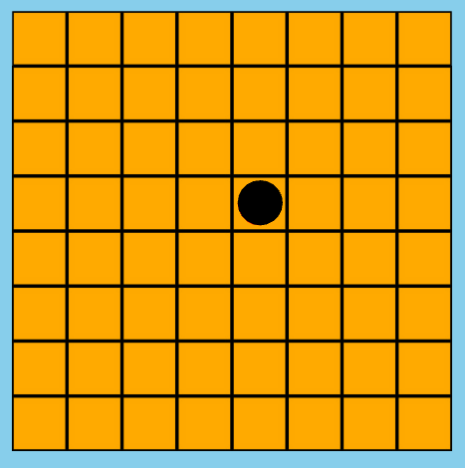
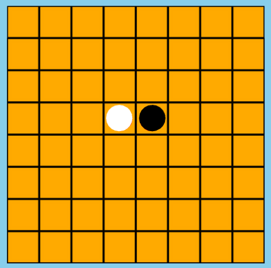
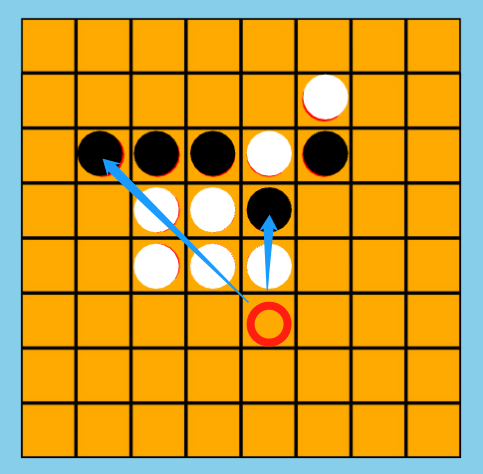
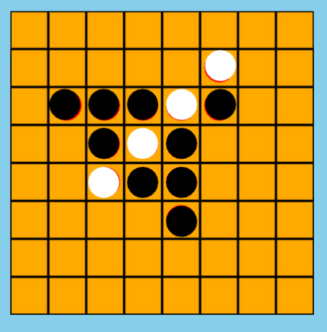
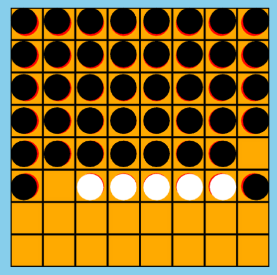
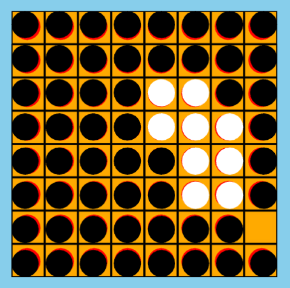
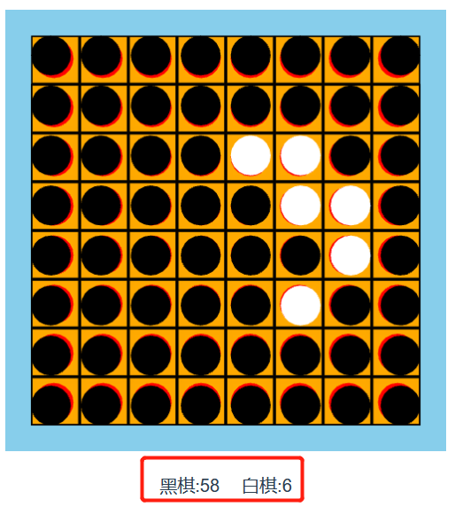
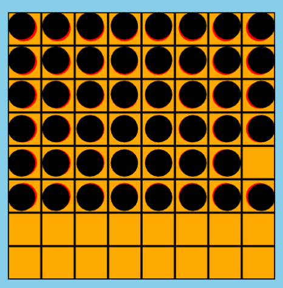

# 游戏引擎


游戏使用js完成，这个游戏，我Python和js都开发过，感觉还是Python更友好，各种数组操作都非常容易


# 基本显示


## 棋盘(board)


游戏是在8*8的棋盘上落子


所以创建棋盘也就是可以落子的位置就是一个行=8，列=8的二维矩阵


```js
/**
 * 复位
 */
const _data = [];
for(let m = 0; m < 8; m++) {
  const arr = [];
  for(let n = 0; n < 8; n++) {
    arr.push(0);
  }
  _data.push(arr);
}
```

## 棋子(piece)


二维数组中都是0，就代表没有落子

```json
[
  [ 0, 0, 0, 0, 0, 0, 0, 0 ],
  [ 0, 0, 0, 0, 0, 0, 0, 0 ],
  [ 0, 0, 0, 0, 0, 0, 0, 0 ],
  [ 0, 0, 0, 0, 0, 0, 0, 0 ],
  [ 0, 0, 0, 0, 0, 0, 0, 0 ],
  [ 0, 0, 0, 0, 0, 0, 0, 0 ],
  [ 0, 0, 0, 0, 0, 0, 0, 0 ],
  [ 0, 0, 0, 0, 0, 0, 0, 0 ]
]
```


我们定义个一常量


```js
const Engine = {};
Engine.CHESS = {
  NONE: 0,  // 没有棋子
  BLACK: 1, // 黑棋
  WHITE: 2  // 白棋
};
```


如果某个位置是1，就是那个位置是黑棋


```json
[
  [ 0, 0, 0, 0, 0, 0, 0, 0 ],
  [ 0, 0, 0, 0, 0, 0, 0, 0 ],
  [ 0, 0, 0, 0, 0, 0, 0, 0 ],
  [ 0, 0, 0, 0, 1, 0, 0, 0 ],
  [ 0, 0, 0, 0, 0, 0, 0, 0 ],
  [ 0, 0, 0, 0, 0, 0, 0, 0 ],
  [ 0, 0, 0, 0, 0, 0, 0, 0 ],
  [ 0, 0, 0, 0, 0, 0, 0, 0 ]
]
```





如果某个位置是2，就是那个位置是白棋


```json
[
  [ 0, 0, 0, 0, 0, 0, 0, 0 ],
  [ 0, 0, 0, 0, 0, 0, 0, 0 ],
  [ 0, 0, 0, 0, 0, 0, 0, 0 ],
  [ 0, 0, 0, 2, 1, 0, 0, 0 ],
  [ 0, 0, 0, 0, 0, 0, 0, 0 ],
  [ 0, 0, 0, 0, 0, 0, 0, 0 ],
  [ 0, 0, 0, 0, 0, 0, 0, 0 ],
  [ 0, 0, 0, 0, 0, 0, 0, 0 ]
]
```





# 规则判断


## 判断落子位置合法


最简单的就是判断坐标是否在棋盘上，也就是判断要大于等于0，且小于等于7


> 坐标都是从0开始断的，开发人员都懂，但是我们也要给初学者说一下


```js
/**
  * 在棋盘上
  * @param {int} row 行
  * @param {int} col 列
  * @returns {Boolean} 是否在棋盘上
  */
function isValid( row, col ) {
  return (row >= 0 && row <= 7 && col >= 0 && col <= 7);
}
```

## 获取反转棋子


```js
/**
 * 获得可以翻的棋
 * @param {int} row 行
 * @param {int} col 列
 * @param {int} color 颜色
 * @returns {Array} 可反转的位置
 */
function getFilp(row, col, color) {
  if (_data[row][col] !== 0) { // 所在位置必须可以落子
    return false;
  }
  if (!isValid(col, row)) { // 坐标在棋盘上
    return false;
  }
  _data[row][col] = color; // 落子
  const arr = [];
  const opColor = color === Engine.CHESS.BLACK ? Engine.CHESS.WHITE : Engine.CHESS.BLACK; // 获取对手棋子颜色
  const direction = [[0, 1], [1, 1], [1, 0], [1, -1], [0, -1], [-1, -1], [-1, 0], [-1, 1]]; // 横纵斜8个方向
  for(const coord of direction) {
    const [ xdirection, ydirection ] = coord;
    let x = parseInt(col);
    let y = parseInt(row);
    do {
      x += xdirection;
      y += ydirection;
    } while(isValid(y, x) && _data[y][x] === opColor); // 横纵或者斜线一个方向一直找到不是对方颜色或者不在棋盘上
    if(!isValid(y, x)) continue; // 超出棋盘直接跳出
    if(_data[y][x] === color) { // 如果最后停止的颜色是自己的棋子颜色，过程中的对手棋子都为反转棋子
      while (isValid(y, x)) {
        x -= xdirection;
        y -= ydirection;
        if (y == parseInt(row) && x == parseInt(col)) break; // 回到之前落子跳出
        arr.push({col:x, row:y}); // 两子之间敌方棋子存入数组
      }
    }
  }
  _data[row][col] = 0; // 还原落子之前状态，因为很多需要判断可以落子而不是直接落子
  if(arr.length === 0) return false;
  return arr;
}
```


比如下图，红色位置落黑子，往上以及左上位置，到黑子之前的白子都会反转





最后会是这样的结果





## 走棋


走棋(落子)时候，要判断必须是合法区域，也就是棋盘上，并且可以反转对方的棋子


```js
/**
 * 走棋
 * @param {int} row 行
 * @param {int} col 列
 * @param {int} color 颜色
 */
function move(row, col, color){
  let flips  = getFilp(row, col, color);
  if(flips) { // 有可以反转的地方棋子才可落子
    for(const obj of flips) {
      _data[obj.row][obj.col] = color;
    }
  } else {
    return;
  }
  _data[row][col] = color;
}
```

## 判断是否有可走的棋


每次交换落子时候，需要先判断是否有可以落子的位置


```js
/**
 * 获取合法点
 * @param {emun} color 棋色
 */
function getLegal(color) {
  if(isNaN(color)) color = _current;
  const direction = [[-1, 0], [-1, 1], [0, 1], [1, 1], [1, 0], [1, -1], [0, -1], [-1, -1]];
  const opColor = color === Engine.CHESS.BLACK ? Engine.CHESS.WHITE : Engine.CHESS.BLACK;
  const nears = [];
  for(const m in _data) {
    for(const n in _data[m]) {
      if(_data[m][n] === opColor) { // 遍历所有对手棋子
        for(const coord of direction) {
          const [ dx, dy ] = coord;
          let x = parseInt(n) + dx;
          let y = parseInt(m) + dy;
          if(isValid(y, x) && _data[y][x]=== Engine.CHESS.NONE // 找到对手棋子横纵斜八个方向没有任何落子的坐标
          && nears.findIndex(k => k[0] === x && k[1] === y) === -1) { // 去除重复坐标
            nears.push([x, y]);
          }
        }
      }
    }
  }
  const arr = [];
  for(const coord of nears) {
    if(getFilp(coord[1], coord[0], color)) { // 可以反转即存入数组
      arr.push(coord);
    }
  }
  return arr;
}
```


如果没有可以反转对手棋子的位置，就要交换对手落子


比如下面这种情况，白棋没有任何可以翻起的黑子，只能丧失一次落子机会，继续让黑棋落子





这种情况也一样





## 胜负判断


游戏结束的情况有两种


1. 下满8*8的棋盘，棋子多的一方为胜





2. 翻掉对方所有棋子




