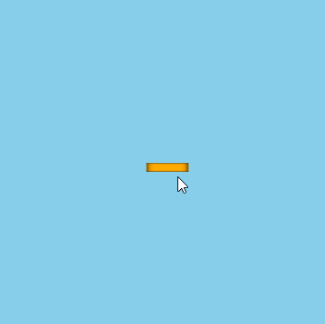
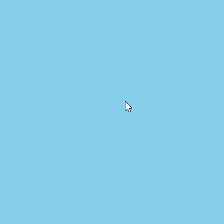
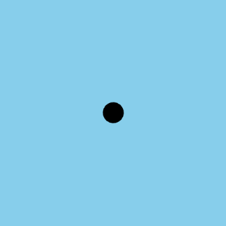
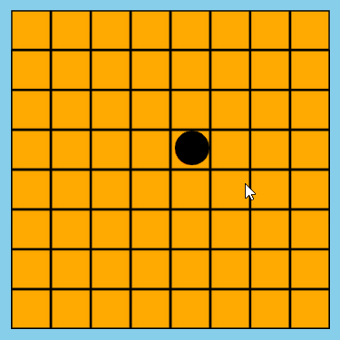
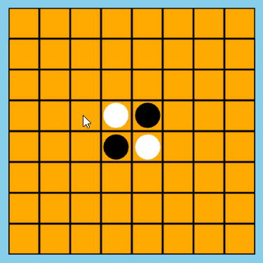

# 游戏界面


现在的游戏大部分都是用的3D引擎，即使2D游戏也是3D显示2D，因为3D转2D只要设置摄像机就完成，但是2D基本转不了3D


所以为了游戏效果，我做的3D游戏


> 当然，我自身很喜欢3D，6年前就一直在研究


## 语言


HTML、JAVASCRIPT


## 框架


ThreeJS


官网: https://threejs.org/


# 建模


3D游戏，第一步是要建模，这个模型可以720度显示


这个游戏比较简单，所以各种建模都只用内置就完成了，并不需要专业的软件(3dmax、maya)去建模


## 棋盘


首先，棋盘的一个方格


就是创建一个立方体，材质颜色是橙色，然后纹理设置为一个图片


./textures/square.jpg 图片为 


为了继承three的mesh，我们使用的function创造class，并不难，其实就是换个写法罢了


```js
import { Mesh, BoxGeometry, MeshBasicMaterial, TextureLoader } from 'three';
import image from './textures/square.jpg';
/**
 *	方块
 */
const Square = function() {
  const _this = this;
  _this.row = NaN; // 方块行，也就是y坐标
  _this.col = NaN; // 方块列，也就是x坐标
	/**
	 *	初始化
	 */
	_this.init = () => {
    const g = new BoxGeometry(Square.WIDTH, Square.HEIGHT, Square.WIDTH); // 创建立方体
    const t = new TextureLoader().load(image); // 读取纹理图片
    const m = new MeshBasicMaterial( { color: 0xffaa00, map: t } ); // 设置材质颜色为橙色，并添加纹理
    Mesh.call(_this, g, m); // 超类
  };
	_this.init();
};

Square.WIDTH = 10; // 棋盘方块边长
Square.HEIGHT = 2; // 棋盘方块高

Square.prototype = Object.create( Mesh.prototype );
Square.prototype.constructor = Square;
export default Square;
```

模型效果





然后把8*8个方块拼成棋盘





## 棋子


棋子就是一个圆柱体，一面是白色，一面是黑色


```js
import { Mesh, CylinderGeometry, MeshBasicMaterial } from 'three';
import Engine from './engine';
/**
 *	棋子
 */
const Piece = function(param) {
  const _this = this;
  let _color = null; // 棋子颜色
  /**
   *	初始化
    */
  _this.init = (color) => {
    const geometry = new CylinderGeometry(Piece.RADIUS, Piece.RADIUS, Piece.WIDTH, Piece.SEGMENT);
    const materials = [
      new MeshBasicMaterial( { color: "red" } ), // 圆柱侧边
      new MeshBasicMaterial( { color: "black" } ), // 圆柱顶
      new MeshBasicMaterial( { color: "white" } ) // 圆柱底
    ];
    Mesh.call(_this, geometry, materials);
    _color = parseInt(color);
    if(_color == Engine.CHESS.WHITE) { // 根据颜色决定初始旋转度
      _this.rotation.x = Math.PI; // 按照x轴旋转180度就是白子
    }
  };
	_this.init(param);
};

Piece.RADIUS = 4; // 棋子半径
Piece.HEIGHT = 1; // 棋子厚度
Piece.SEGMENT = 20; // 棋子横断面，越大越圆

Piece.prototype = Object.create( Mesh.prototype );
Piece.prototype.constructor = Piece;
export default Piece;
```


模型效果





# 游戏


为了游戏生动，我们使用了tween库实现缓动动画


https://github.com/tweenjs/tween.js/


## 落子


落子要实现一个棋子从上往下降的动画


```js
import { Tween, Easing } from '@tweenjs/tween.js';
let coord = { y: 10 }; // 落子为y=10位置，到y=0位置的动画
const t = new Tween(coord).to({y:0}, 500).easing(Easing.Quadratic.In);
t.onUpdate((e) => {piece.position.y = e.y;});
t.start();
```

动画效果





## 反转


反转动画用三个动画链接完成


1. 棋子上升
2. 棋子反转
3. 棋子下降


```js
import { Tween, Easing } from '@tweenjs/tween.js';
let rotation = { x: 0 };
let coord = { y: 0 };
const up = new Tween(coord).to({y: 10}, 300).onUpdate((e) => {_this.position.y = e.y;}); // 升起动画
const down = new Tween(coord).to({y: 0}, 200).onUpdate((e) => {_this.position.y = e.y;}); // 下降动画
const spin = new Tween(rotation).to({x: Math.PI}, 300).onUpdate((e) => {_this.rotation.x = initX + e.x;}); // 旋转动画
spin.chain(down); // 旋转跟下降链接
up.chain(spin); // 上升跟旋转链接
up.delay(delay);
up.start(); // 最终动画为：升起->旋转->落下
```

动画效果





## 逻辑


游戏的逻辑基本都在engine.js里，这里纯数据


然后根据数据让棋子显示动效，达到比较好的游戏体验


内容太多了，请看源码


- github: https://gitee.com/thales-ucas/reversi-web.git
- gitee: https://gitee.com/thales-ucas/reversi-web.git


# 扩展


游戏完全自己做的，所以也没啥产品设计，其实还有更多可以让用户用的方便的地方


# 结语


苹果棋这个游戏介绍完毕，这里包含了游戏引擎，人工智能，界面显示以及最开始的演示四个部分